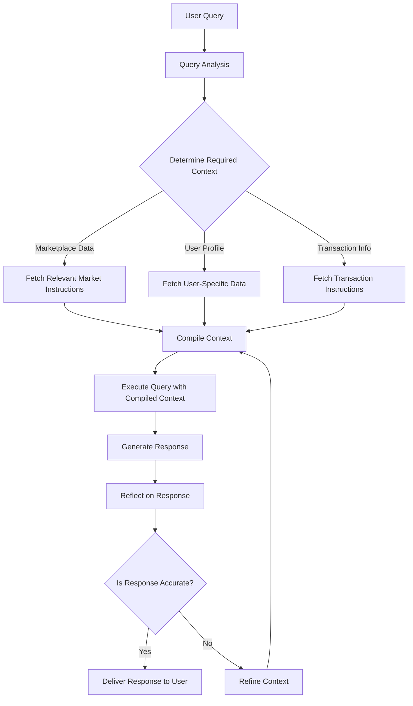

# Atlas Link: Advanced DeFi Assistant for Star Atlas Marketplace

## A Comprehensive Documentation of an AI-Powered DeFi Tool for Data Presentation and Visualization in the Star Atlas Ecosystem

### Abstract

This document presents a detailed overview of Atlas Link, an advanced AI-powered assistant designed to revolutionize user interaction with the Star Atlas game marketplace. Leveraging the capabilities of ChatGPT and integrating with blockchain technologies, Atlas Link offers unprecedented access to on-chain data, market analytics, and personalized DeFi services within the Star Atlas ecosystem.


Project Summary Link: 
[Atlas Link Docs](https://docs.google.com/document/d/1llFgBs-1YpxqEUhkvJRpCsnFP0G007Dp_20XHjWDB9s/edit#heading=h.isv578hufhmm)

Project Demo Link:
[Atlas Link: Gateway to AI-Powered Interstellar Commerce](https://www.youtube.com/watch?v=LW9toyjEZaU)


---

## Table of Contents

1. [Introduction](#1-introduction)
2. [System Architecture](#2-system-architecture)
3. [Integration with ChatGPT](#3-integration-with-chatgpt)
4. [Unique Capabilities](#4-unique-capabilities)
5. [API Documentation](#5-api-documentation)
6. [Authentication and Blockchain Integration](#6-authentication-and-blockchain-integration)
7. [Key Features](#7-key-features)
8. [Data Models and Visualization](#8-data-models-and-visualization)
9. [Error Handling and System Reliability](#9-error-handling-and-system-reliability)
10. [Use Cases and Examples](#10-use-cases-and-examples)
11. [Key Challenges and Solutions](#11-key-challenges-and-solutions)
12. [Implementation and Usage](#11-implementation-and-usage)
13. [Development and Deployment](#12-development-and-deployment)
14. [Future Directions and Conclusions](#13-future-directions-and-conclusions)

---

## 1. Introduction

Atlas Link represents a significant advancement in the integration of artificial intelligence with decentralized finance (DeFi) and gaming ecosystems. Built as a custom GPT model on the ChatGPT platform, Atlas Link serves as an intelligent interface between users and the complex world of the Star Atlas marketplace. This documentation provides a comprehensive overview of Atlas Link's capabilities, architecture, and potential applications in the realm of DeFi and blockchain-based gaming.

### 1.1 Purpose and Scope

Atlas Link is designed to:
- Facilitate seamless navigation of the Star Atlas marketplace
- Provide real-time, on-chain data analysis and visualization
- Offer personalized DeFi services within the Star Atlas ecosystem
- Enhance user engagement through natural language interaction

### 1.2 Target Audience

- Star Atlas players seeking advanced market insights
- DeFi enthusiasts interested in blockchain-gaming intersections
- Developers and researchers in AI-driven financial systems
- Crypto traders focusing on gaming asset markets

---

## 2. System Architecture

Atlas Link's architecture is a sophisticated blend of AI, blockchain technology, and traditional web services, designed to provide a seamless and intelligent interface for Star Atlas marketplace interactions.

### 2.1 Core Components

1. **AI Interface (Custom GPT)**:
   - Built on ChatGPT platform
   - Processes natural language inputs
   - Generates context-aware responses
   - Orchestrates API calls to backend services

2. **Flask Backend**:
   - RESTful API service
   - Manages authentication and session handling
   - Processes and formats data for AI consumption
   - Interfaces with Node.js backend for blockchain operations

3. **Node.js Backend**:
   - Handles direct Solana blockchain interactions
   - Manages Phantom wallet connections
   - Executes smart contract calls and transaction signing

### 2.2 Data Flow

1. User interacts with Atlas Link through ChatGPT interface
2. AI model interprets queries and triggers appropriate API calls
3. Flask backend processes requests, fetching data from various sources
4. Node.js backend interacts with Solana blockchain when necessary
5. Data is processed, analyzed, and returned through the chain to the user
6. AI model presents information in a user-friendly, conversational format

---

## 3. Integration with ChatGPT

Atlas Link leverages the advanced natural language processing capabilities of ChatGPT to create an intuitive and powerful user interface for the Star Atlas marketplace.

### 3.1 Custom GPT Model

- Built on ChatGPT platform (chat.openai.com)
- Fine-tuned for Star Atlas-specific terminology and concepts
- Capable of understanding complex DeFi and gaming queries

### 3.2 AI-Driven Interaction

- Natural language processing for user queries
- Context-aware responses and follow-up questions
- Dynamic generation of market analysis and recommendations

---

## 4. Unique Capabilities

Atlas Link offers several groundbreaking features that set it apart in the realm of AI-assisted DeFi platforms:

### 4.1 On-Chain Data Access

- Real-time fetching and analysis of blockchain data
- Direct integration with Solana network for up-to-the-minute accuracy

### 4.2 Phantom Wallet Integration

- Secure connection to users' Phantom wallets
- Ability to view balances, assets, and transaction history
- Initiation of transactions directly through conversational interface

### 4.3 Advanced Market Analytics

- Real-time order book analysis
- Price trend predictions using AI algorithms
- Personalized trading suggestions based on user portfolio

### 4.4 Interactive Data Visualization

- Generation of custom charts and graphs on-demand
- Visual representation of market trends and user portfolio performance

---

## 5. API Documentation

Atlas Link exposes several API endpoints to facilitate various operations. Here's a summary of the key endpoints:

### 5.1 Authentication
- `GET /getlogin`: Initiates user authentication
- `GET /validate_authentication_route`: Validates user's authentication status

### 5.2 Item Details
- `GET /item_detail/{mint_id}`: Retrieves item details by mint ID

### 5.3 Order Book
- `GET /orders_by_assets/{mint_id}`: Retrieves buy and sell orders for a specific asset
- `GET /orderbook_summary/{mint_id}`: Retrieves a summary of the orderbook for a specific asset

### 5.4 Player Details
- `GET /player_details`: Retrieves player inventory and profile information

### 5.5 Transactions
- `GET /create_order/{transaction_type}/{mint_id}`: Initiates a buy or sell order for a specific asset

For detailed information on request parameters, response formats, and example usage, please refer to the `actions.yaml` file in the project repository.

---

## 6. Authentication and Blockchain Integration

### 6.1 Authentication Flow

Atlas Link uses a secure authentication flow to link users' Phantom wallets:

1. User requests to authenticate
2. System generates a unique login URL and pairing key
3. User clicks on the provided login URL
4. User connects their Phantom wallet
5. System validates the authentication
6. User's public key is stored and associated with their session

### 6.2 Key Authentication Steps

1. Call `/getlogin` to get the login URL and pairing key
2. Present the login URL to the user as a clickable image
3. Once the user confirms linking, call `/validate_authentication_route`
4. Store the returned public key for future API calls

### 6.3 Blockchain Integration

- Direct integration with Solana blockchain
- Real-time fetching of on-chain data
- Secure transaction signing and submission

---

## 7. Key Features

### 7.1 Market Navigation
- Browse items by type, category, and class
- View detailed item information
- Use JSON files for efficient data retrieval

### 7.2 Order Book Analysis
- View buy and sell orders for specific assets
- Get statistical summaries of order books
- Visualize order book data with charts and graphs

### 7.3 User Authentication
- Secure wallet linking with Phantom
- Session management with pairing keys

### 7.4 Profile Management
- View player inventory
- Check account balance
- See player stats and ranks

### 7.5 Transaction Creation
- Place bids on items
- Create sell orders
- Streamlined process with clear user guidance

---

## 8. Data Models and Visualization

### 8.1 Item Data
- Stored in `detial_items.json`
- Fields: name, symbol, mint_id, itemType, category, rarity, image

### 8.2 Category Mappings
- `category_map_medium.json`: High-level category mapping
- `category_map_large.json`: Detailed category mapping including rarity

### 8.3 Mint ID Mapping
- `mint_id_map.json`: Maps item names to their respective mint IDs

### 8.4 Order Book Data
- Dynamic data fetched from Star Atlas API
- Includes: price, quantity, order type (buy/sell)

### 8.5 Player Profile
- Includes: public key, avatar ID, faction rank, overall rank, country, registration date
- Inventory data with item quantities and values

### 8.6 Data Visualization
- Real-time chart generation for market trends
- Visual representations of user portfolios and asset distributions

---

## 9. Error Handling and System Reliability

Atlas Link implements robust error handling to ensure a smooth user experience:

### 9.1 API Errors
- Proper status codes and error messages are returned
- Detailed error logging for backend debugging

### 9.2 Authentication Errors
- Clear messages for failed authentication attempts
- Guided recovery process for users

### 9.3 Transaction Errors
- Detailed feedback on why a transaction might have failed
- Suggestions for resolving common transaction issues

### 9.4 Data Not Found
- Appropriate responses when requested data is unavailable
- Suggestions for alternative queries or actions

### 9.5 System Monitoring
- Continuous monitoring of system health and performance
- Automated alerts for critical issues

---

## 10. Use Cases and Examples

### 10.1 Market Navigation
```
User: Show me the available ship classes in Star Atlas.
Assistant: Certainly! Let me fetch the available ship classes for you from Star Atlas. Here's a breakdown of the ship classes:

1. XX-Small
2. X-Small
3. Small
4. Medium
5. Large
6. Capital
7. Commander

Each class represents a different size and capability level for ships in Star Atlas. Would you like more details about a specific class or see some examples of ships in a particular class?
```

### 10.2 Order Book Analysis
```
User: What's the current market for the Pearce X4?
Assistant: Certainly! I'll fetch the current market data for the Pearce X4 ship. Let me check the order book for you.

[Assistant calls the /orders_by_assets/{mint_id} and /orderbook_summary/{mint_id} endpoints]

Here's a summary of the Pearce X4 market:

Buy Orders:
- Highest bid: 95.50 USDC
- Lowest bid: 90.00 USDC
- Total buy orders: 15

Sell Orders:
- Lowest ask: 97.25 USDC
- Highest ask: 105.00 USDC
- Total sell orders: 12

Market Summary:
- Spread: 1.75 USDC
- 24h Volume: 1,250 USDC
- Market depth (up to 10% from mid-price): 25,000 USDC

Would you like to see a detailed order book or place an order for the Pearce X4?
```

### 10.3 Profile Management
```
User: What's in my Star Atlas inventory?
Assistant: Certainly! I'll check your Star Atlas inventory for you. First, let me verify your authentication status.

[Assistant calls /validate_authentication_route]

Great! You're authenticated. Now, let me fetch your inventory details.

[Assistant calls /player_details]

Here's a summary of your Star Atlas inventory:

1. Pearce X4 (Ship - Rare)
   Quantity: 2
   Total Value: 195.50 USDC

2. Opal Jet (Ship - Epic)
   Quantity: 1
   Total Value: 500.00 USDC

3. ATLAS Token
   Balance: 1,000 ATLAS

Your total inventory value (excluding resources): 695.50 USDC

Would you like more details on any specific item in your inventory?
```

---


## 11. Key Challenges and Solutions

In the development of Atlas Link, an AI-powered assistant for the Star Atlas marketplace, our team encountered several significant challenges that required innovative solutions. These challenges were fundamental to creating a seamless, reliable, and efficient system capable of interacting with the complex Star Atlas ecosystem. We identified three primary challenges and developed corresponding solutions:

### 1. Seamless Integration of Solana Accounts

**Challenge:**
The primary challenge was to create a frictionless connection between Solana-based accounts, specifically the Phantom wallet, and AI platforms like ChatGPT. Traditional methods would require users to manually enter their wallet details, disrupting the conversational flow and potentially creating security risks. Moreover, we needed a solution that would work universally, not just for our specific implementation.

**Solution:**
We developed Atlas Link, a proprietary authentication system that bridges ChatGPT accounts and chats with the Phantom wallet. Key features of this solution include:

- Seamless Integration: Users can connect their Phantom wallet to the chatbot without leaving the chat interface.
- Universal Compatibility: Atlas Link is designed to work with ChatGPT and potentially other AI platforms, making it a versatile solution for blockchain-AI integration.
- Enhanced Security: By using a dedicated authentication system, we ensure that sensitive wallet information is handled securely.
- Improved User Experience: The authentication process maintains the natural flow of conversation, enhancing overall user engagement.

This solution allows any chatbot, regardless of its developer, to integrate with the Solana blockchain ecosystem securely and efficiently.

### 2. Managing Complex Data Flows and Large Datasets

**Challenge:**
The Star Atlas ecosystem is vast and complex, encompassing multiple components, extensive game mechanics, and a large marketplace. Replicating this entire ecosystem within a chatbot presented several difficulties:

- Data Volume: The sheer amount of information needed to cover all aspects of Star Atlas was enormous.
- Complex Interactions: Multiple flows with detailed instructions were required to enable users to interact with various parts of the ecosystem seamlessly.
- Context Limitations: Most chatbots struggle with maintaining complex flows and instructions due to limited token windows and context sizes.
- Data Accuracy: Ensuring the bot accesses and references the correct data, especially for financial transactions, was crucial.

Traditional solutions like Retrieval-Augmented Generation (RAG) often led to hallucinations when dealing with such complex datasets.

**Solution:**
To address these challenges, we implemented a Dynamic Context Mapping system, also referred to as Just-In-Time (JIT) Mapping. This innovative approach works as follows:

1. Query Analysis: The bot analyzes the user's query to understand the specific prompt and required information.
2. Instruction Fetching: Based on the analysis, the system fetches only the relevant instructions and data needed to execute the prompt.
3. Contextual Execution: The bot then executes the prompt using the fetched instructions and data, ensuring accuracy and relevance.


#### Dynamic Context Mapping

To address the challenge of managing complex data flows and large datasets, we implemented a Dynamic Context Mapping system. This system allows for efficient handling of the vast Star Atlas ecosystem data while maintaining accuracy and relevance in responses. Here's how it works:



This dynamic context mapping approach ensures that the AI assistant can access and utilize the full scope of Star Atlas data without being overwhelmed, leading to more accurate and relevant responses while maintaining scalability and flexibility.

The process works as follows:

1. The system starts with a user query.
2. It analyzes the query to determine the required context.
3. Based on the analysis, it fetches only the relevant instructions and data needed (marketplace data, user profile, transaction info, etc.).
4. The fetched information is compiled into a context.
5. The query is executed using this compiled context.
6. A response is generated.
7. The system reflects on the response to check for accuracy.
8. If accurate, the response is delivered to the user.
9. If not accurate, the context is refined, and the process loops back to compile a new context.

This approach significantly improves the AI's ability to handle complex queries while maintaining accuracy and relevance in the vast Star Atlas ecosystem.

#### Benifits

Benefits of this approach include:

- Efficient Data Handling: The bot can access the full scope of data without being overwhelmed by irrelevant information.
- Improved Accuracy: By fetching specific, relevant data for each query, the chances of hallucination or incorrect responses are significantly reduced.
- Scalability: This method allows the bot to handle increasingly complex ecosystems and datasets without compromising performance.
- Flexibility: The system can adapt to new information and ecosystem changes more easily than static instruction sets.

### 3. Enhancing Instruction Adherence and Mitigating Hallucinations

**Challenge:**
Even with clear instructions and well-mapped flows, AI models are prone to deviating from the intended path. This can lead to several issues:

- Incorrect Navigation: The bot might guide users to the wrong sections of the marketplace or ecosystem.
- Hallucinations: Generation of false or irrelevant information, especially problematic when dealing with financial data.
- Inconsistent Responses: Lack of adherence to established flows can result in inconsistent user experiences.

These issues are particularly critical in a blockchain gaming context where accuracy in asset management and financial transactions is paramount.

**Solution:**
To combat these challenges, we implemented a state-of-the-art engineering technique known as "reflection," which was released on September 6, 2024. This approach involves a multi-step process:

1. Plan Formulation: The bot clearly states its plan for responding to the user's query.
2. Self-Reflection: The AI then reflects on this plan, analyzing its potential weaknesses or inconsistencies.
3. Plan Modification: Based on the reflection, the bot modifies its plan if necessary.
4. Execution: Only after this reflective process does the bot execute its response.

Key advantages of this reflection mechanism include:

- Drastic Reduction in Hallucinations: By questioning its own logic, the bot significantly reduces instances of false information.
- Improved Accuracy: The reflection process ensures that the bot stays on track, especially for complex queries.
- Enhanced Complex Query Handling: This method excels in managing multi-step, complex queries that require integrating various data sources.

An example of the bot's enhanced capability is demonstrated in processing a complex query like "Find the best ship out of the 270+ NFTs which fits my balance." The reflection mechanism allows the bot to:

1. Recognize the need to check the user's current balance (requiring on-chain data retrieval).
2. Understand that fetching live data for all 270+ NFTs would be resource-intensive.
3. Decide to estimate prices based on historical data to narrow down the search.
4. Finally, make a suggestion based on this comprehensive analysis.

This level of sophisticated query processing demonstrates the power of the reflection mechanism in handling complex, multi-faceted requests accurately and efficiently.

By implementing these innovative solutions, Atlas Link sets new standards for AI interactions within blockchain ecosystems, particularly suited for the complex and dynamic world of Star Atlas. These advancements not only solve immediate challenges but also pave the way for more sophisticated AI-blockchain integrations in the future.


## 12. Implementation and Usage

This section provides detailed information on how to set up, use, and understand the structure of the Atlas Link project.

### 12.1 Project Structure

The Atlas Link project is organized into two main components: a Flask backend and a Node.js backend. Here's an overview of the project structure:

```
Star_Link/
├── Flask_backend/
│   ├── app/
│   │   ├── __init__.py
│   │   ├── routes.py
│   │   ├── transactions.py
│   │   ├── profile_data.py
│   │   ├── item_data.py
│   │   ├── order_book.py
│   │   ├── helper_functions/
│   │   │   ├── open_ai_request_mapper.py
│   │   │   ├── profile_data.py
│   │   │   └── ...
│   │   ├── instructions/
│   │   │   ├── instructions.py
│   │   │   └── ...
│   │   ├── templates/
│   │   │   ├── login.html
│   │   │   ├── transaction.html
│   │   │   └── ...
│   │   └── static/
│   │       ├── js/
│   │       │   ├── login.js
│   │       │   ├── phantom_connect.js
│   │       │   ├── transaction.js
│   │       │   └── ...
│   │       └── ...
│   ├── app.py
│   ├── image_data.md
│   ├── info.yaml
│   └── resources/
│       ├── sample_curl.md
│       ├── reverse_map.json
│       ├── detial_items.json
│       └── ...
│
└── Node_backend/
    ├── data.js
    ├── transaction.js
    └── wallet-connect.js
```

### 12.2 Setup and Installation

To set up the Atlas Link project, follow these steps:

1. Clone the repository:
   ```
   git clone https://github.com/your-repo/Star_Link.git
   cd Star_Link
   ```

2. Set up the Flask backend:
   ```
   cd Flask_backend
   python -m venv venv
   source venv/bin/activate  # On Windows use `venv\Scripts\activate`
   pip install -r requirements.txt
   ```

3. Set up the Node.js backend:
   ```
   cd ../Node_backend
   npm install
   ```

4. Configure environment variables:
   - Create a `.env` file in both Flask_backend and Node_backend directories
   - Add necessary environment variables (API keys, endpoints, etc.)

### 12.3 Running the Application

1. Start the Flask backend:
   ```
   cd Flask_backend
   python app.py
   ```

2. In a new terminal, start the Node.js backend:
   ```
   cd Node_backend
   node server.js
   ```

3. The Atlas Link system is now running and ready to accept requests from the ChatGPT interface.

### 12.4 Using Atlas Link

To use Atlas Link:

1. Access the custom GPT through the ChatGPT interface (chat.openai.com).
2. Start a conversation by asking about Star Atlas marketplace items, your inventory, or current market conditions.
3. For actions requiring authentication, Atlas Link will guide you through the process of connecting your Phantom wallet.
4. Follow the conversational prompts to navigate the marketplace, view order books, manage your profile, or initiate transactions.

### 12.5 Key Files and Their Purposes

- `Flask_backend/app/routes.py`: Defines the main API routes for the Flask backend
- `Flask_backend/app/transactions.py`: Handles transaction-related operations
- `Flask_backend/app/profile_data.py`: Manages user profile and inventory data
- `Node_backend/data.js`: Interfaces with the Star Atlas blockchain for data retrieval
- `Node_backend/transaction.js`: Manages blockchain transactions
- `Node_backend/wallet-connect.js`: Handles Phantom wallet connections

### 12.6 Customization and Extension

To extend Atlas Link's capabilities:

1. Add new API endpoints in `Flask_backend/app/routes.py`
2. Implement new blockchain interactions in the Node.js backend files
3. Update the ChatGPT model's training data to recognize new commands or features
4. Modify `Flask_backend/resources/` JSON files to update item data or category mappings

Remember to update the `actions.yaml` file and this documentation when adding new features or making significant changes.

## 13. Development and Deployment

### 13.1 Development Environment

1. Use an IDE with Python and Node.js support (e.g., Visual Studio Code, PyCharm)
2. Set up linters and formatters for code consistency (e.g., ESLint for JavaScript, Black for Python)
3. Use version control (Git) for collaborative development and feature branching

### 13.2 Testing

1. Implement unit tests for individual functions in both Flask and Node.js backends
2. Create integration tests to ensure proper communication between components
3. Develop end-to-end tests simulating user interactions through the ChatGPT interface

### 13.3 Continuous Integration/Continuous Deployment (CI/CD)

1. Set up a CI/CD pipeline using tools like Jenkins, GitLab CI, or GitHub Actions
2. Automate testing and linting processes on each commit
3. Configure automatic deployment to staging environments for approved changes

### 13.4 Deployment

#### Flask Backend
1. Choose a cloud platform (e.g., Heroku, AWS Elastic Beanstalk, Google Cloud Run)
2. Set up environment variables for production settings
3. Configure WSGI server (e.g., Gunicorn) for production use
4. Set up SSL certificates for secure communication

#### Node.js Backend
1. Select a suitable hosting platform (e.g., Heroku, DigitalOcean, AWS EC2)
2. Use process managers like PM2 for Node.js application management
3. Set up reverse proxy (e.g., Nginx) for improved security and performance
4. Implement proper logging and monitoring solutions

### 13.5 Monitoring and Maintenance

1. Set up application performance monitoring (e.g., New Relic, Datadog)
2. Implement log aggregation for easier debugging and analysis
3. Regularly update dependencies and address security vulnerabilities
4. Perform regular backups of critical data

## 14. Future Directions and Conclusions

### 14.1 Potential Enhancements

1. Multi-chain Support: Extend Atlas Link to interact with multiple blockchain ecosystems beyond Solana.
2. Advanced AI Features: Implement more sophisticated market prediction algorithms and personalized investment strategies.
3. Mobile Application: Develop a companion mobile app for on-the-go access to Atlas Link's features.
4. Social Trading: Introduce features for users to share and follow trading strategies within the Star Atlas community.
5. Integration with DeFi Protocols: Allow users to participate in yield farming, liquidity provision, and other DeFi activities directly through Atlas Link.

### 14.2 Scalability Considerations

1. Implement caching mechanisms to reduce blockchain query load
2. Optimize database queries and consider sharding for improved performance
3. Explore serverless architectures for more efficient resource utilization
4. Implement rate limiting and request queuing to handle high traffic scenarios

### 14.3 Research Opportunities

1. AI-driven market manipulation detection in blockchain gaming economies
2. Impact of AI assistants on user engagement and trading behavior in NFT marketplaces
3. Comparative analysis of different blockchain networks for gaming asset trading
4. Privacy-preserving techniques for AI-assisted DeFi interactions

### 14.4 Conclusion

Atlas Link represents a significant step forward in the integration of AI, DeFi, and blockchain gaming. By providing an intelligent, conversational interface to the complex world of the Star Atlas marketplace, it opens up new possibilities for user engagement, market analysis, and decentralized finance within gaming ecosystems.

As the project evolves, it has the potential to reshape how users interact with digital asset markets, making complex DeFi operations more accessible to a broader audience. The success of Atlas Link could pave the way for similar AI-driven assistants across various blockchain and gaming platforms, ultimately contributing to the mainstream adoption of decentralized technologies.

The combination of natural language processing, real-time blockchain data analysis, and user-friendly interfaces positions Atlas Link at the forefront of the next generation of DeFi tools. As we continue to develop and refine this system, we invite the community to contribute, explore, and help shape the future of AI-assisted decentralized finance in the gaming world.